# 🏛 핀테크 프로젝트를 위한 JOA OpenAPI 🏛

# 목차

### [**1. 서비스 개요**](#📌-서비스-개요)

### [**2. 기획 배경**](#☁-기획-배경)

### [**3. 서비스 기능 소개**](#🏛-서비스-기능-소개)

### [**4. 팀 구성**](#👨🏻‍💻-팀-구성)

### [**5. 기술 스택**](#🛠️-기술-스택)

### [**6. 아키텍처**](#🎨-아키텍처)

### [**7. 주요기능**](#💡-주요기능)

### [**8. 시연영상**](#🎬-시연-영상)

### [**9. UCC**](#ucc)

### [**프로젝트 산출물**](#📄-프로젝트-산출물)

# 📌 서비스 개요

- 개발 기간 : 2024.02.19 ~ 2024.04.05 (7주)
- 개요 : 핀테크 프로젝트를 위한 금융 OpenAPI 제공
- 타겟 : 핀테크 개발자

# ☁ 기획 배경

- 제한된 API 종류
- API가 유료이거나 신청이 복잡함
- 데이터 셋을 만드는 것이 번거로움

# 🏛 서비스 기능 소개

- Docs : 공식 문서 가이드, API 테스트베드 제공
- Admin : 데이터 통계를 확인할 수 있는 관리자 대시보드 제공, 더미데이터 생성
- App : OpenAPI를 쉽게 테스트 할 수 있는 앱 (계좌 조회, 거래내역 조회, 이체 등)

# 👨🏻‍💻팀 구성

| [조아영](https://github.com/aycho00)                                                       | [구본승](https://github.com/kbs3103)                                                      | [고수림](https://github.com/sulim0314)                                                     | [김희연](https://github.com/heeyeon3050)                                                   | [이유로](https://github.com/rheeeuro)                                                     | [이정호](https://github.com/paul-lee-dev)                                                 |
| ------------------------------------------------------------------------------------------ | ----------------------------------------------------------------------------------------- | ------------------------------------------------------------------------------------------ | ------------------------------------------------------------------------------------------ | ----------------------------------------------------------------------------------------- | ----------------------------------------------------------------------------------------- |
|  |  |  |  |  |  |
| 팀장, 풀스택                                                                               | 백엔드                                                                                    | 인프라, 백엔드                                                                             | 백엔드 리더                                                                                | 이유로                                                                                    | 이정호                                                                                    |
| 팀장, 풀스택 Docs 페이지 구현 사용자 인증/인가                                 | 은행 생성 API 개발 더미데이터 API 개발                                            | CI/CD 구축 이메일 인증 및 검색 API 개발                                            | 계좌, 상품 API 개발  거래내역 API 개발                                             | 애플리케이션 구현 Admin 페이지 API 연동                                               | Admin 레이아웃 구현  대시보드 구현                                                |

 

# 🛠️ 기술 스택

**Front**
 

**Back**
 

**Database**
 

**Environment**
 

**Cooperation**
 

 

# 🎨 아키텍처

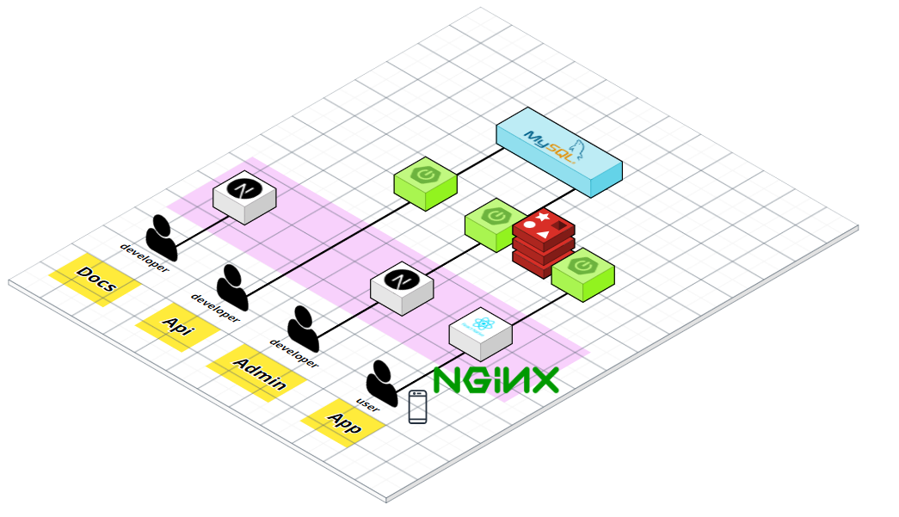{: width="50%" height="50%"}
 

# 💡 주요기능

## **Docs**

### 1. 메인화면

- Docs의 다양한 기능들을 Overview로 제공
   

{: width="50%" height="40%"}
 
 

### 2. Docs

- API를 쉽게 사용할 수 있도록 사용법 제공
- 시작하기, 용어 정의, 프로젝트 구조, 커스텀 방법, 샘플 앱 이용법
   

{: width="50%" height="40%"}
 
 

### 3. APIs

- 43개의 API의 Request, Response 정보 제공
- Request, Response 정보를 제공하고, 이를 바탕으로 테스트베드 사용
   

{: width="50%" height="40%"}
 
 

## **Admin**

### 1. 설정

- 설정에서 API 키 발급/재발급 가능
   

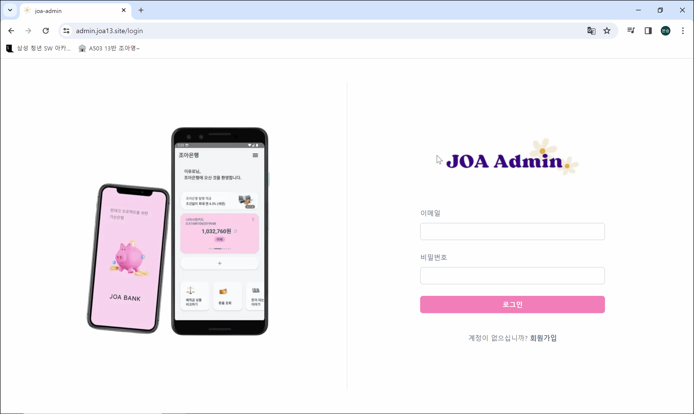{: width="50%" height="40%"}
 
 

### 2. 대시보드

- 총 거래횟수, 고객수, 총 출금액, 총 입금액 통계 제공
- 데이터를 바탕으로 한 차트 제공. 파일 export 가능
   

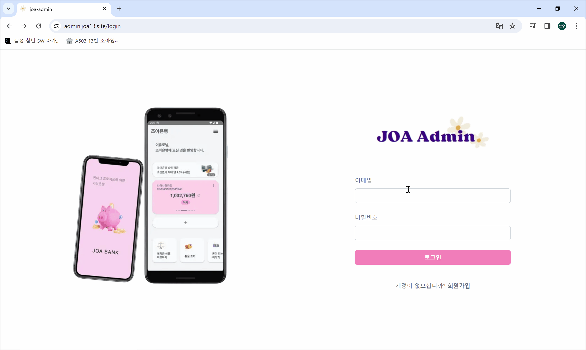{: width="50%" height="40%"}
 
 

### 3. 은행

- 은행 생성 시, 자동으로 기본 입출금통장 생성
   

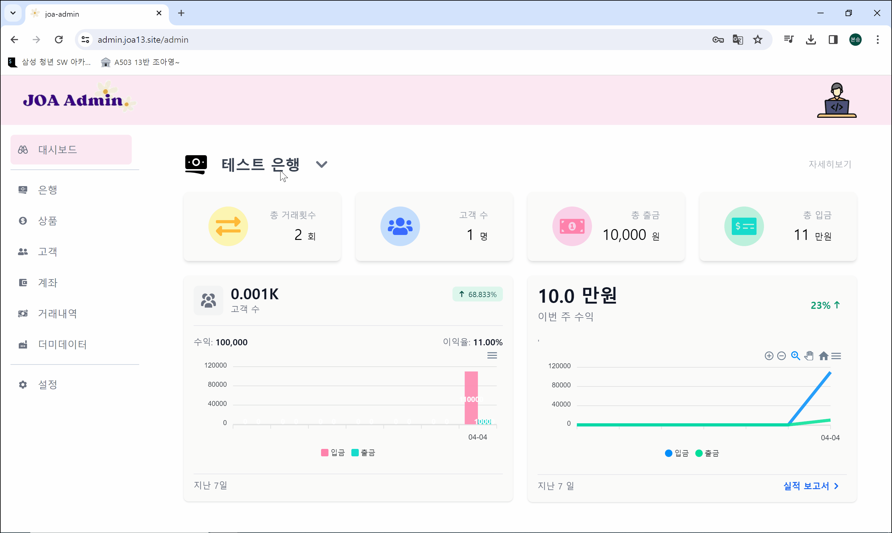{: width="50%" height="40%"}
 
 

### 4. 상품

- 상품 생성 시: 상품 종류 선택, 금리 설정, 이자율 설정, 지급 방법 선택
   

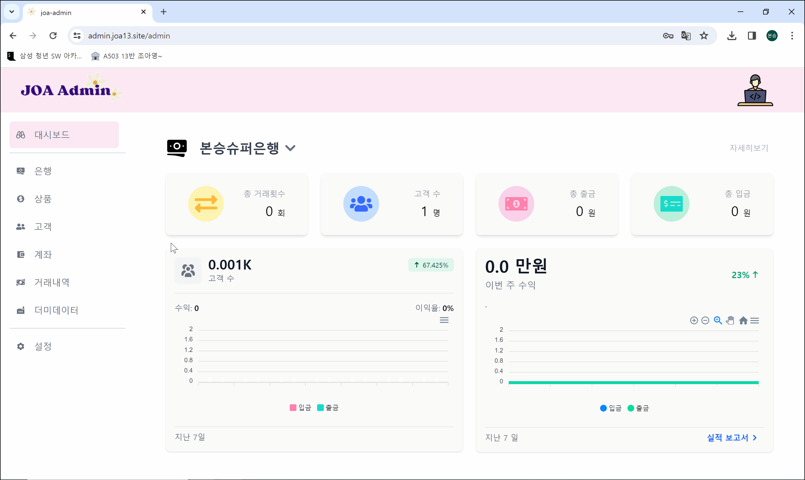{: width="50%" height="40%"}
 
 

### 5. 계좌

- 계좌 신청 시: 출금 계좌 선택, 입금 금액 입력, 기간 선택, 과세 유형 선택, 비밀번호 입력
   

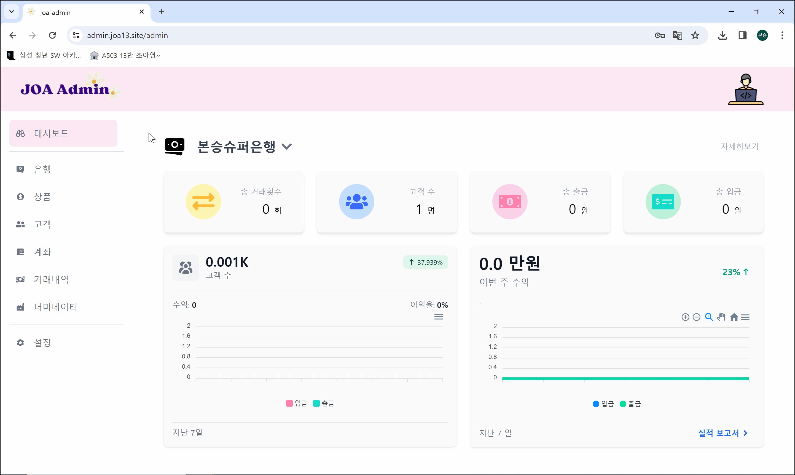{: width="50%" height="40%"}
 
 

### 6. 고객

- 은행에 등록된 고객들에 대한 조회
   

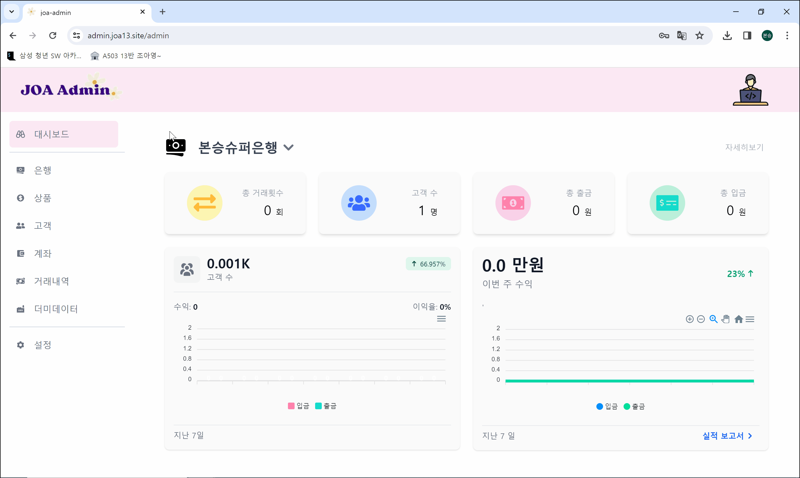{: width="50%" height="40%"}
 
 

### 7. 거래내역

- 입금, 출금, 이체, 이자에 대한 내역들 조회
   

{: width="50%" height="40%"}
 
 

### 8. 더미데이터

- 은행, 계좌, 거래내역 편하게 생성
- 더미데이터 개수 입력
- 원하는 주기에 자동으로 생성
   

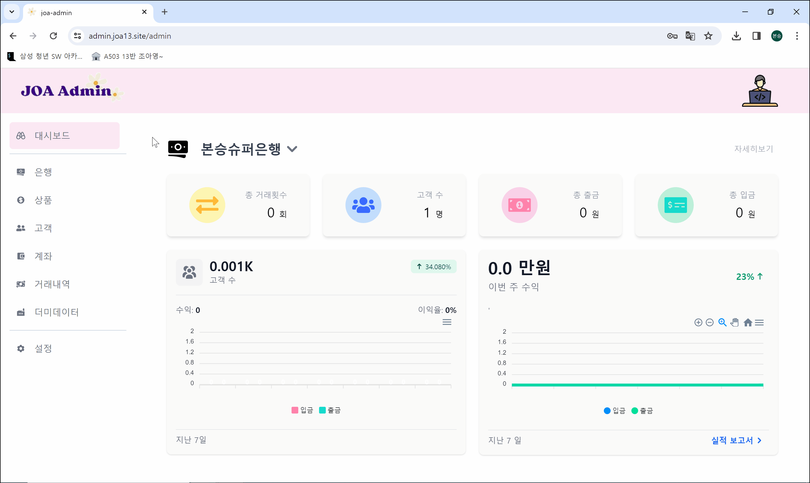{: width="50%" height="40%"}
 
 

## **App**

### 1. 회원가입 / 로그인

{: width="20%" height="20%"}
{: width="20%" height="20%"}
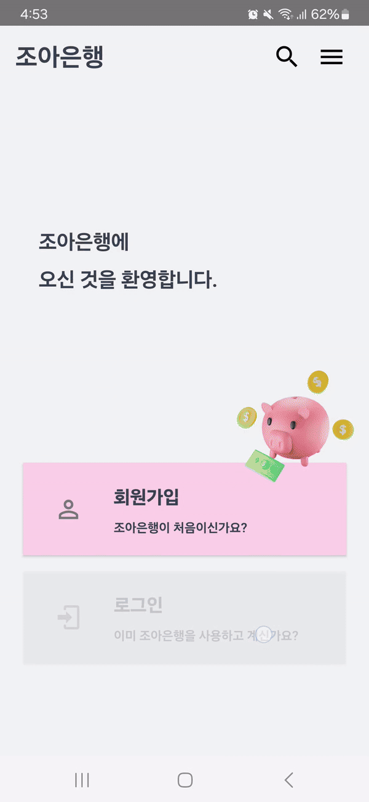{: width="20%" height="20%"}
 

### 2. 계좌생성

{: width="20%" height="20%"}
{: width="20%" height="20%"}
 

### 3. 계좌조회

{: width="20%" height="20%"}
{: width="20%" height="20%"}
 

### 4. 이체

{: width="20%" height="20%"}
 

### 5. 거래내역 조회

{: width="20%" height="20%"}
 

### 6. 은행코드 변경

{: width="20%" height="20%"}
 
 

# 🎬 UCC

[{: width="50%" height="40%"}](https://www.youtube.com/watch?v=fE_YQiPRDG8)
 

# 📄 프로젝트 산출물

### [1. 요구사항 명세서](https://joyous-panther-248.notion.site/ecbdfe5401f544fabd2ef787d504a2e7?v=c37ca8d9e0614a699c0b7d4fd5053977&pvs=4)

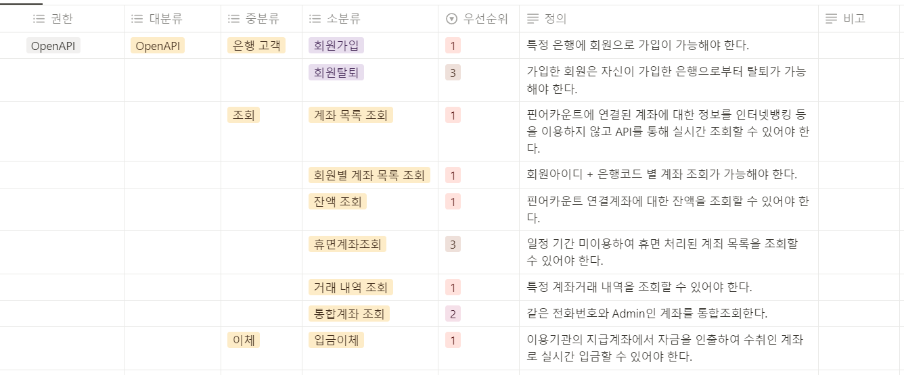{: width="50%" height="30%"}

### [2. ERD](https://joyous-panther-248.notion.site/ERD-87128130a6a24b09a8fb751879ec867d?pvs=4)

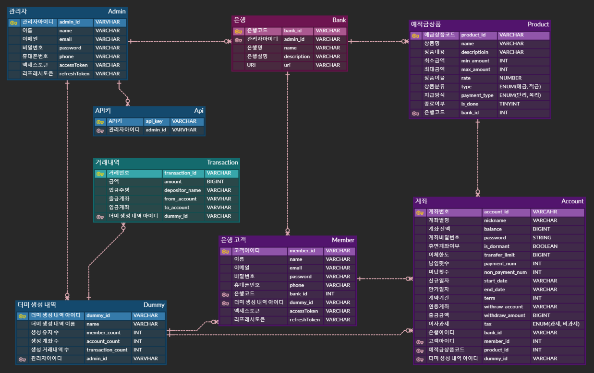{: width="50%" height="30%"}

### [3. API 명세서](https://joyous-panther-248.notion.site/API-2eab3ac9ef1b46c780b53af9c3ae6854?pvs=4)

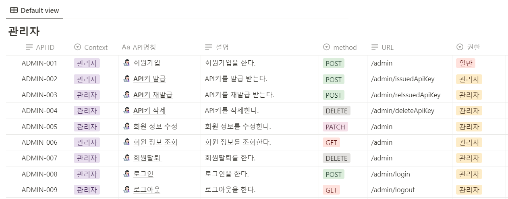{: width="50%" height="30%"}
 

# 참고

### [노션](https://joyous-panther-248.notion.site/A503-13-7e43baa015974b2eb153f22c622f4c84?pvs=4)
