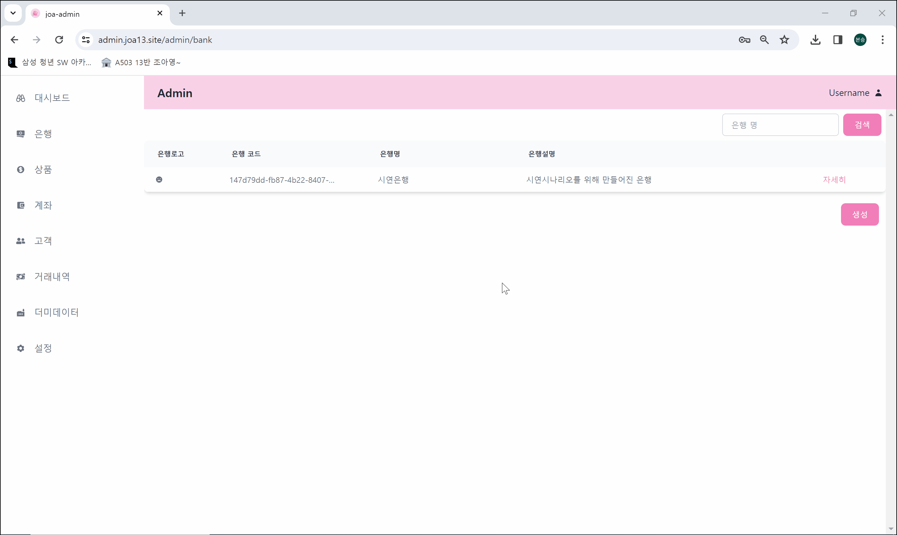
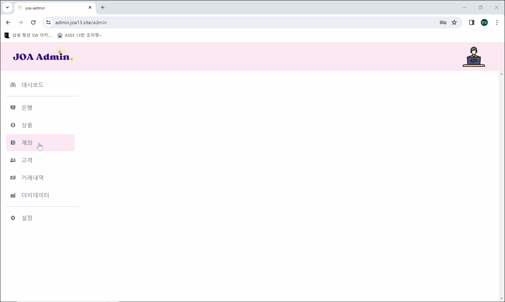
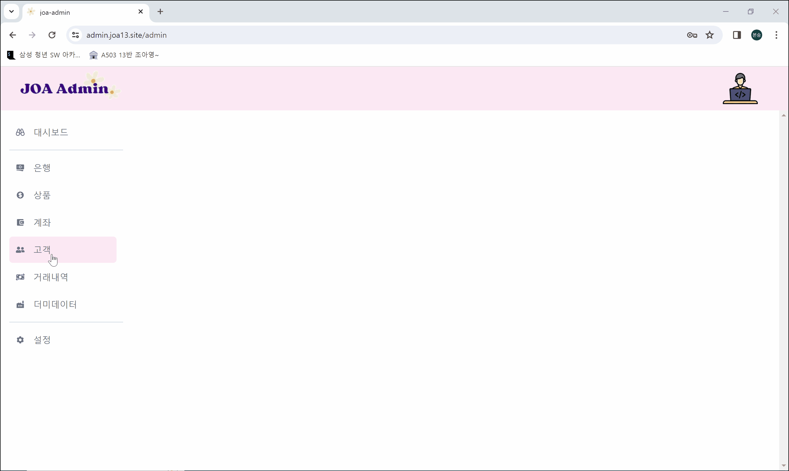
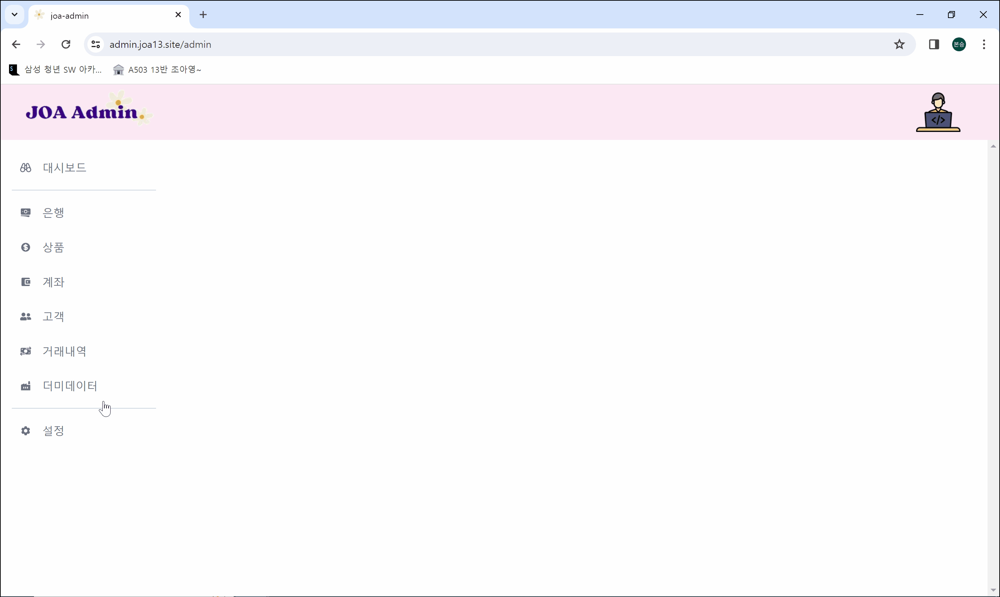
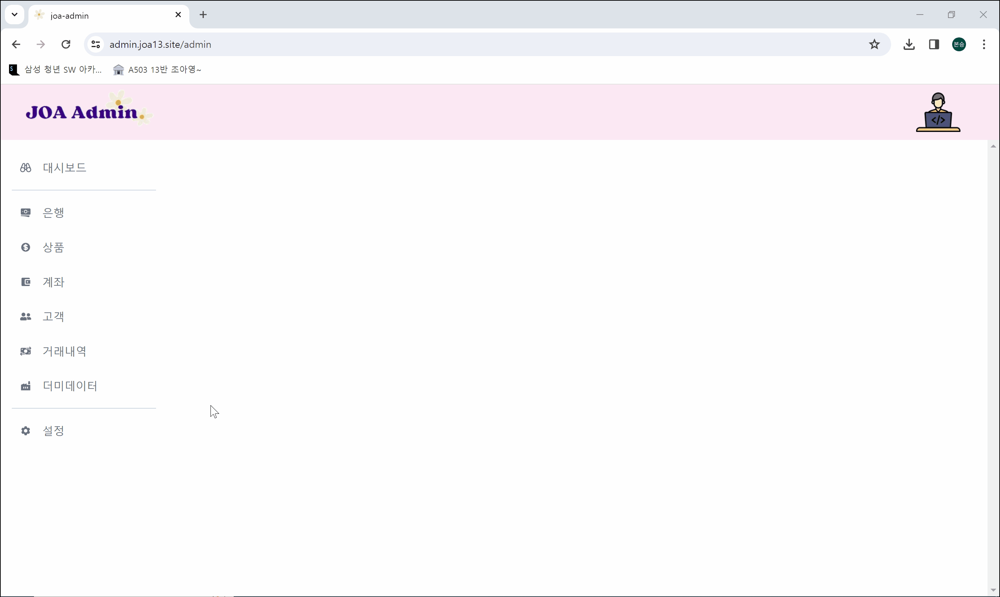
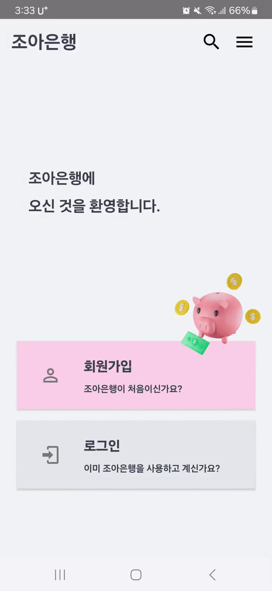

# 핀테크 프로젝트를 위한 금융 OpenAPI  JOA OpenAPI

# 목차

1. [**서비스 소개**](#서비스-소개)
2. [**기획 배경**](#기획-배경)
3. [**팀 구성**](#개발-멤버-및-일정-소개)
4. [**기능 소개**](#기능-소개)
5. [**시연 영상**](#시연-영상)
6. [**기술 스택**](#기술-스택)
7. [**프로젝트 일정 및 산출물**](#프로젝트-산출물)
8. [**UCC**](#UCC)
9. [**참고**](#참고)

# 서비스 소개
- 기간 : 2024.03.~
- 인원 : 6명
- 개요 : 핀테크 프로젝트를 위한 금융 OpenAPI 제공
- 타겟 : 핀테크 개발자

# 기획 배경
- 제한된 API 종류
- API가 유료이거나 신청이 복잡함
- 데이터 셋을 만드는 것이 번거로움

# 기능 소개
- Docs : 공식 문서 가이드, API 테스트베드 제공
- Admin : 데이터 통계를 확인할 수 있는 관리자 대시보드 제공, 더미데이터 생성
- App : OpenAPI를 쉽게 테스트 할 수 있는 앱 (계좌 조회, 거래내역 조회, 이체 등)

# 팀 구성
| [조아영](https://github.com/benyy0101)                                                    | [구본승](https://github.com/rheeeuro)                                                     | [고수림](https://github.com/JHyeon-a)                                                                                          | [김희연](https://github.com/heeyeon3050)                                                   | [이유로](https://github.com/Damongsanga)                                                   | [이정호](https://github.com/Zerotay)                                                      |
| ----------------------------------------------------------------------------------------- | ----------------------------------------------------------------------------------------- | ------------------------------------------------------------------------------------------------------------------------------ | ------------------------------------------------------------------------------------------ | ------------------------------------------------------------------------------------------ | ----------------------------------------------------------------------------------------- |
|  |  |  |  |  |  |
| Leader, Front                                                                             | Front, Back                                                                               | Front                                                                                                                          | Back                                                                                       | Back                                                                                       | CI&CD, Front                                                                              |
| PM 로그인 페이지 방 목록 페이지 채널, 라운지 페이지                                                            | 캠/화면 공유 방 동시성 구현 코드 동시 편집 메인페이지                                    | UI/UX 게시판 페이지 유저페이지 S3 이미지 업로드                           | 캠/화면 공유  방 동시성 구현 실시간 채팅 게시판 CRUD                         | 인증/인가  방 CRUD 채널, 라운지 CRUD  메타데이터 로직                                                | 인프라 구축  CI/CD API 연동 게시판 페이지                                                                   |

 

# 기술 스택
**Front**
 

**Back**
 

**Database**
 

**Environment**
 

**Cooperation**
 

 

# 아키텍처

# 시연 영상

# 주요기능

### **Docs**

1. 메인화면
 

2. Docs
 

3. APIs
 

### **Admin**

1. 설정
 

2. 대시보드
 

3. 은행
 

4. 상품
 

5. 계좌
 

6. 고객
 

7. 거래내역
 

8. 더미데이터
 

### **App**

1. 회원가입 / 로그인
 

2. 계좌생성
 

3. 계좌조회
 

4. 이체
 

5. 거래내역 조회
 

6. 은행코드 변경
 

# UCC

# 프로젝트 산출물

### 1. ERD

### 2. API 문서

### 3. 요구사항 명세서

# 참고
